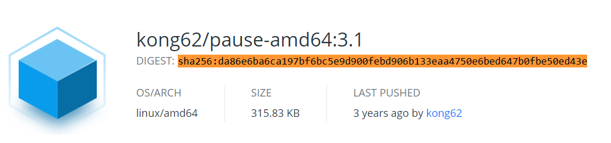
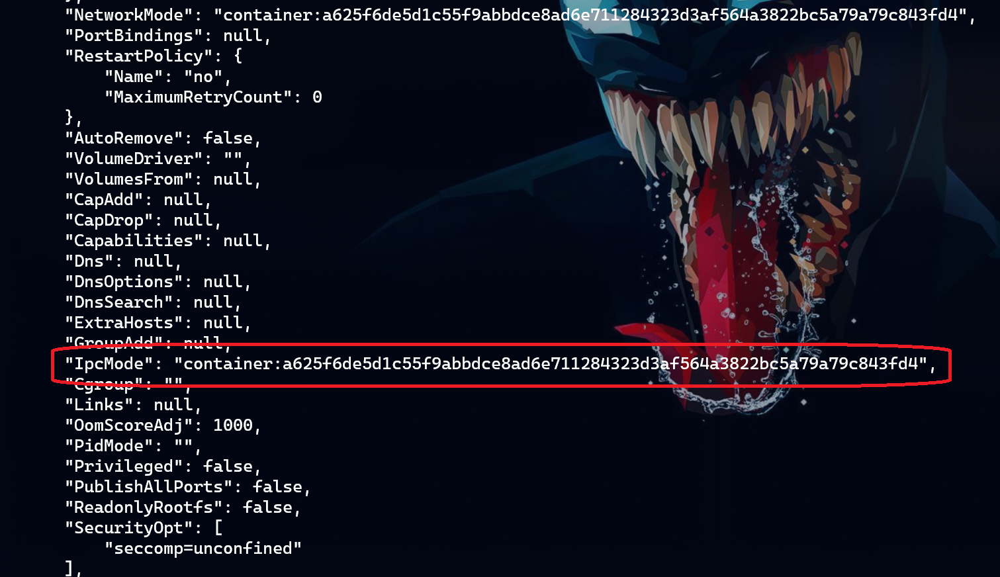

# dapr-demo
Some samples that I use to demo Dapr capabilities

## Some info to trace the sidecar details

### Pause Container

**Image**: kong62/pause-amd64:3.1
**DIGEST**:sha256:da86e6ba6ca197bf6bc5e9d900febd906b133eaa4750e6bed647b0fbe50ed43e

> Docker Hub URL: [LINK](https://hub.docker.com/layers/kong62/pause-amd64/3.1/images/sha256-da86e6ba6ca197bf6bc5e9d900febd906b133eaa4750e6bed647b0fbe50ed43e?context=explore)

### Docker IPC option

Docker IPC documenation: [LINK](https://docs.docker.com/engine/reference/run/#ipc-settings---ipc)

